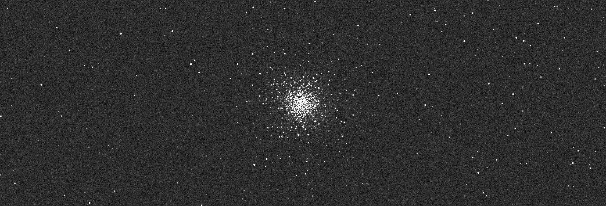

# cabaret

*cabaret* is a Python package to simulate astronomical images using the [GAIA catalog](https://en.wikipedia.org/wiki/Gaia_catalogues) of stars.
## Installation

You can install *cabaret* in a Python (`>=3.11`) environment with

```bash
pip install cabaret
```

or from a local clone

```bash
git clone https://github.com/ppp-one/cabaret
pip install -e cabaret
```

You can test the package has been properly installed with

```bash
python -c "import cabaret"
```

## Example

### Basic image 

To generate an image from RA/DEC coordinates and a field of vue specified in degrees:

```python
import cabaret

ra, dec = 12.3323, 30.4343 # in degrees
exposure_time = 10 # in seconds

image = cabaret.generate_image(ra, dec, exposure_time)
```

and to display the image (`matplotlib` required here):

```python
import matplotlib.pyplot as plt

plt.imshow(image)
```

### Using the camera characteristics

To adjust the physical characteristics of the camera, you can define and pass a `Camera` object. Similary, one can pass `Telescope` and `Site` objects to define the telescope and site characteristics, respectively.

```python
import cabaret
from cabaret import Camera

camera = Camera(read_noise=10, gain=1)

ra, dec = 12.3323, 30.4343 # in degrees
exposure_time = 10 # in seconds

image = cabaret.generate_image(ra, dec, exposure_time, camera=camera)
``` 