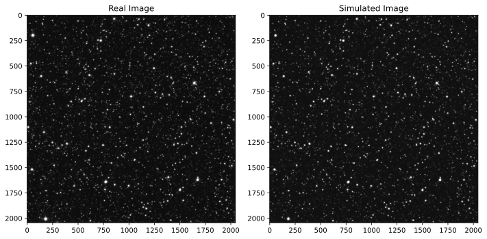
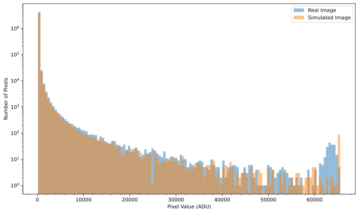
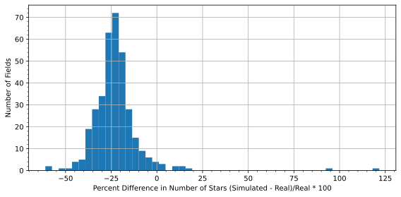

# Summary

Astronomical research increasingly relies on realistic simulations to interpret observations, test hypotheses, and develop new analysis techniques. `cabaret` is a Python package designed to simulate astronomical images using the Gaia [@gaia] and cross-matched 2MASS [@tmass] catalog of stars, providing researchers and educators with a fast, flexible tool for generating synthetic stellar field images. The package integrates real astronomical data with customizable observatory configurations, enabling users to simulate images that accurately reflect site and instrumental conditions. `cabaret` is particularly well-suited for validating data reduction pipelines, training machine learning models, developing observatory control software, and educational applications where simulated astronomical data is needed.

# Statement of need

To increase confidence in the development of modern astronomical instrumentation and software, it is necessary to model and test with simulated data.

<!-- Existing image simulation tools often fall into two categories: highly specialized packages designed for specific surveys or instruments [REFs], or over-simplified simulators [REFs] which lack the necessary realism suitable for scientific application.  -->
\**existing lit*\* `cabaret` fills a gap by providing an accessible, easy-to-use package that generates realistic stellar field images with minimal setup while maintaining the flexibility to customize observatory parameters for specific use cases.

<!-- `cabaret` has already proven valuable in `alpaca-simulators` [@alpaca], a comprehensive astronomy observatory simulator, by providing realistic image generation. `alpaca-simulators` enables thorough testing of observatory control software without requiring access to physical hardware, such as testing plate solving, guiding algorithms, and flat fielding sequences. -->

# Operation

`cabaret` provides stellar positions and fluxes from the Gaia and cross-matched 2MASS catalog through the `astroquery` [@astroquery] package, retrieving stellar positions, proper motions, fluxes, for a specified field of view and bandpass. Alternatively, users can provide their own source catalogs for full control over the simulated stellar population.

The package implements a modular observatory model with four main components:

- **Telescope**: Configurable aperture, focal length, and collecting area
- **Camera**: Customizable detector dimensions, camera rotation, bias level, pixel pitch, gain, dark current, readout noise, average quantum efficiency, and pixel defects
- **Focuser**: Position and offset parameters for focus effects
- **Site**: Atmospheric seeing, sky background conditions, and location (latitude, longitude, elevation)

All components can be instantiated with the package's defaults or customized to match real instruments. For example, simulating images from a specific telescope requires only specifying its aperture and focal length:

```python
import cabaret

telescope = cabaret.Telescope(aperture=1, focal_length=8)
observatory = cabaret.Observatory(telescope=telescope)
image = observatory.generate_image(ra=12.33, dec=30.43, exp_time=10)
```

Stars are rendered using a Moffat profile [@moffat], a physically-motivated functional form used to model atmospheric seeing.

# Validation

To validate the field production accuracy of `cabaret`, we compared it to 355 fields observed by the SPECULOOS survey [@speculoos] using its I+z filter, as illustrated in \autoref{fig:comparison}. For each field, we generated a simulated image with matching observatory and seeing condition parameters, using the Gaia RP filter as the closest equivalent. 



In the example presented in \autoref{fig:comparison}, the overall field histograms of pixel values between the real and simulated images show good agreement (\autoref{fig:histograms}). Any differences may stem from unmodeled instrumental effects, such as detector non-linear and saturation effects, imperfect point spread functions, scattered light, which are not currently included in `cabaret` simulations. Similarly, differences in instrumental throughput between the Gaia RP filter and the SPECULOOS I+z filter could contribute to discrepancies.



Source detection was then performed on both the real and simulated images with `DAOStarFinder` [@photutils], applying a threshold of seven times the frame’s standard deviation as determined by `sigma_clipped_stats` [@astropy]. The percentage difference in the detected stars' fluxes between the real and simulated images is shown in \autoref{fig:percent-difference}. The mean percentage difference across all 355 fields was $-22.54\pm14.11$%, 

indicating that `cabaret` can accurately reproduce observed stellar fluxes within a few percent, suitable for many scientific applications.



<!-- The package is designed around several key principles:

- **Accessibility**: With just a few lines of Python code, users can generate their first synthetic image.
- **Realism**: Images incorporate source positions, accounting for proper motion, and flux values from Gaia or 2MASS. This is combined with noise modelling [CCD equation ref -- we miss scintillation noise], atmospheric seeing modelling, and injected detector defects.
- **Flexibility**: All observatory components (telescope, camera, focuser, site) are configurable through a simple API, allowing users to match specific instruments or explore parameter spaces.
- **Reproducibility**: All simulations are deterministic when a random seed is provided, ensuring reproducible results for scientific workflows. -->


# Key Features

To be edited/deleted:


# Implementation

`cabaret` is implemented in pure Python with minimal dependencies (`numpy` [@numpy], `astropy` [@astropy], `astroquery` [@astroquery]), making it easy to install and integrate into existing workflows. The package follows modern Python best practices:

- Type hints throughout the codebase
- Dataclass-based configuration for clean, validated interfaces
- Comprehensive docstrings with usage examples
- Automated testing with `pytest` [@pytest]
- Continuous integration and documentation hosting

The image generation algorithm uses an efficient windowed rendering approach, where stars are rendered only within a small region around their position (typically 5× the FWHM). This dramatically reduces computation time compared to global convolution methods while maintaining accuracy.

The package is designed to be extensible, with clear interfaces for adding new detector effects, PSF models, or catalog sources.


# Applications

`cabaret` is designed for a wide range of applications:

- **Pipeline validation**: Test photometry, astrometry, and image processing algorithms with known ground truth
- **Machine learning**: Generate training datasets for neural networks doing source detection, classification, or deblending
- **Observatory control**: Simulate telescope and camera behavior for software development and testing
- **Education**: Teach students about observational astronomy, detector physics, and data analysis
- **Survey planning**: Explore parameter spaces to optimize observing strategies
- **Systematic uncertainty characterization**: Quantify the impact of various instrumental and atmospheric effects

The package has been successfully used in the development of `alpaca-simulators`, which provides a complete simulation environment for ASCOM Alpaca devices, enabling developers to test observatory control software without physical hardware.

# Acknowledgements

We acknowledge the contributions of several key libraries to the functionality of cabaret, specifically `astropy` [@astropy],`astroquery` [@astroquery], and `numpy` [@numpy]. Additionally, we utilized `Matplotlib` [@matplotlib] for the plots in this paper and the package's documentation. We also utilized `prose` [@prose], `photutils` [@photutils], and `pandas` [@reback2020pandas] in the comparison with real observations. Furthermore, testing was conducted using `pytest` [@pytest] to ensure the reliability of our code. This work made use of the Gaia catalog, ESA's space mission for stellar astrometry.

# References
